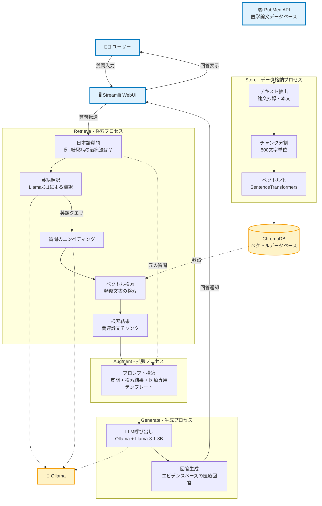

# Medical RAG System (Minimal Configuration)

## 概要

ローカル環境で動作する軽量な医療文献検索・回答生成システムです。


**主な特徴:**
- **技術スタック**: ChromaDB + Ollama (Llama-3.1-8B) + Streamlit
- **データソース**: PubMed医学文献
- **機能**: 医療文献の検索・回答生成

## 前提

### システム要件
- **Python**: 3.10+
- **OS**: Linux/Mac/Windows（WSLにて動作検証済）
- **メモリ**: 8GB以上推奨
- **ストレージ**: 10GB以上

### 事前準備
- Python 3.10+がインストール済み
- Ollamaがインストール済み
- インターネット接続（初回セットアップ時）

## インストール方法

### 1. リポジトリのクローン
```bash
git clone https://github.com/okayamah/medical-rag.git
cd medical-rag
```

### 2. 仮想環境の作成と有効化
```bash
# 仮想環境の作成
python -m venv venv

# 仮想環境の有効化
source venv/bin/activate  # Linux/Mac
# または
venv\Scripts\activate     # Windows
```

### 3. 依存関係のインストール
```bash
pip install -r requirements.txt
```

### 4. Ollamaモデルの取得
```bash
# llama3.1モデルをダウンロード（初回のみ）
ollama pull llama3.1:8b-instruct-q4_0

# 利用可能なモデル一覧の確認
ollama list

# モデルの詳細情報を確認
ollama show llama3.1:8b-instruct-q4_0
```

## 実行方法

### 1. Ollamaサーバーの起動
```bash
# Ollamaサーバーを起動
ollama serve
```

### 2. Streamlitアプリの起動
```bash
# 仮想環境をアクティベート後
streamlit run src/app.py
```

### 3. 動作確認
- ブラウザで http://localhost:8501 にアクセス
- アプリケーションが正常に表示されることを確認

## 注意事項

### システム動作確認
```bash
# Ollamaサーバーが起動しているか確認
lsof -i :11434

# API経由での動作確認
curl http://localhost:11434/api/tags
```

### 医療ドメイン特有の注意点
- **医学的助言ではない**: 本システムは医学的助言を目的としていません
- **参考文献の確認**: 回答には必ず参考文献を確認してください
- **医療従事者への相談**: 医療に関する判断は医療従事者にご相談ください

## ライセンス

このプロジェクトは MIT License の下で公開されています。

## 補足：システムフロー

